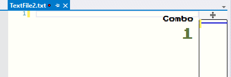

# VSCombo
combo mode for Visual Studio

## Combo Mode
This project implements combo mode as what [activate-power-mode](https://github.com/JoelBesada/activate-power-mode) brings to atom.

Only **Light Theme** considered. Original code without any modification may be not suitable for other color themes.

Modify `ComboGrid.xaml` to use your favorite color. Colors for different champions can be configured in `Champion.cs`

## Press Start 2P
Bitmap font [Press Start 2P](https://github.com/codeman38/PressStart2P) is used.

